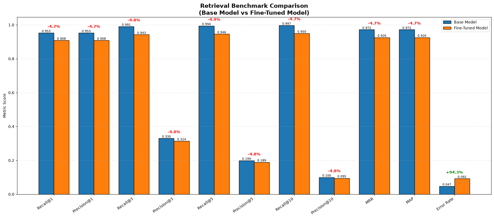
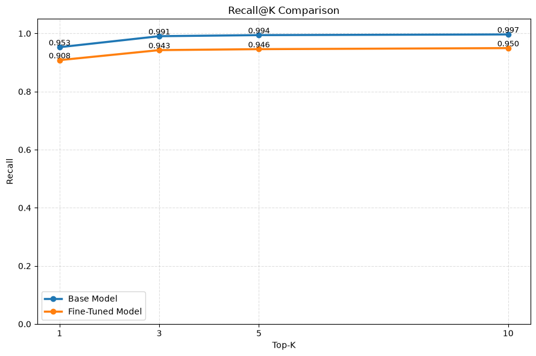
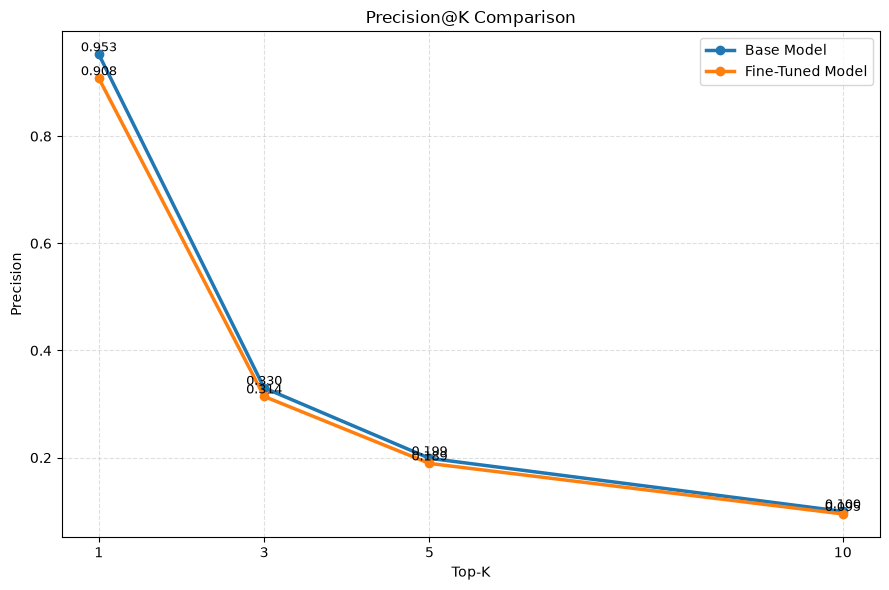
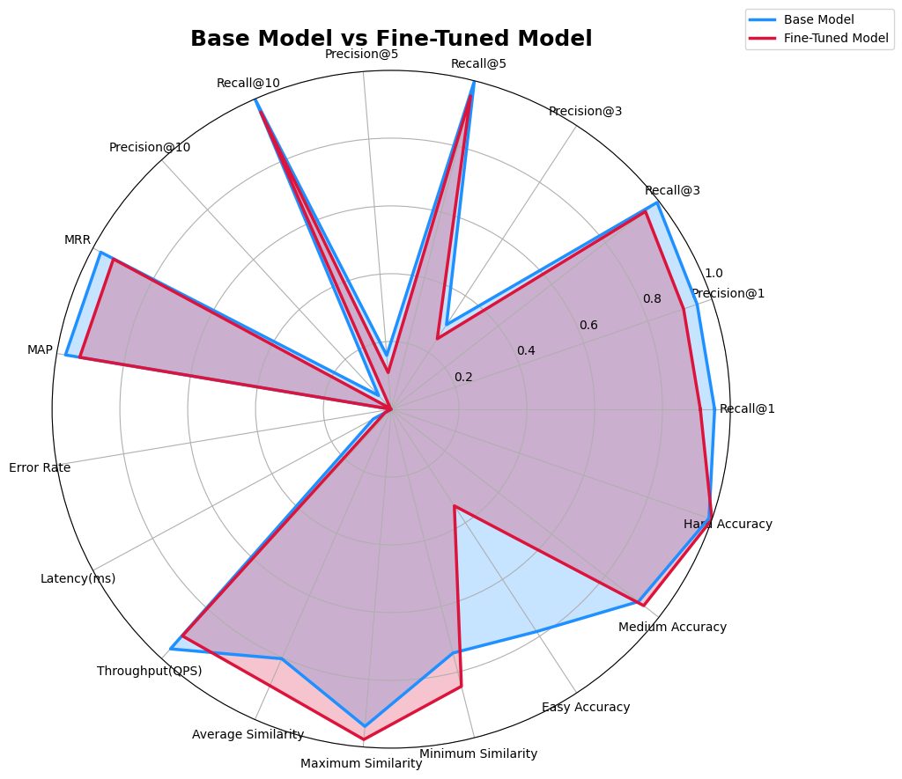
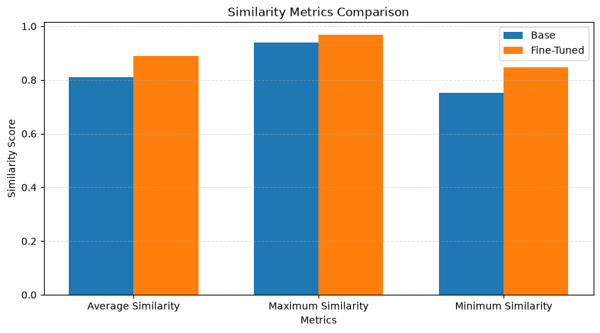
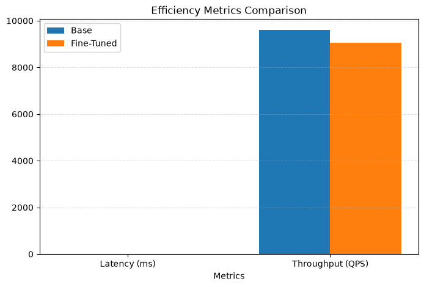
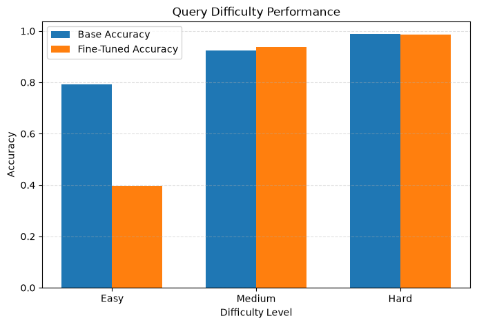

# BOQ Embedding Retrieval Benchmark

> Evaluating whether domain-specific fine-tuning of **Qwen3-Embedding-0.6B** improves dense retrieval on construction Bill of Quantities (BOQ) documents.


---

## TL;DR

Fine-tuning **did not improve** retrieval quality. The **base model outperformed the fine-tuned model on every ranking metric** (Recall, Precision, MRR, MAP), with degradation ranging from **4.5%–6.8%**. Embedding similarity went *up* after fine-tuning, but that did not translate into better rankings — a reminder that similarity and retrieval quality are not the same thing.

---

## Table of Contents

- [Overview](#overview)
- [Dataset](#dataset)
- [Evaluation Pipeline](#evaluation-pipeline)
- [Metrics Tracked](#metrics-tracked)
- [Results](#results)
  - [Retrieval Performance](#retrieval-performance)
  - [Similarity Metrics](#similarity-metrics)
  - [Efficiency](#efficiency)
  - [Query Difficulty](#query-difficulty)
- [Key Findings](#key-findings)
- [Discussion](#discussion)
- [Limitations](#limitations)
- [Future Work](#future-work)
- [Tech Stack](#tech-stack)
- [Repository Structure](#repository-structure)
- [Conclusion](#conclusion)

---

## Overview

This project compares a domain-specific fine-tuned **Qwen3-Embedding-0.6B** model against the original base model on a dense retrieval task for construction Bill of Quantities (BOQ) documents.

**Goal:** determine whether domain-specific fine-tuning improves retrieval quality while maintaining retrieval efficiency.

Both models were evaluated under **identical conditions** — same corpus, same FAISS index, same embedding dimension, same normalization strategy, same query set. Only the embedding model differs, so any difference in results is attributable to fine-tuning.

## Dataset

| | |
|---|---|
| **Documents** | 142 BOQ PDF files |
| **Indexed items** | 26,228 |
| **Embedding dimension** | 1024 |
| **Vector database** | FAISS |
| **PDF extraction** | pdfplumber |
| **Evaluation queries** | 3,990 (synthetically generated, ~3% corpus coverage) |
| **Ground truth** | One relevant document per query |

Each indexed item retains metadata linking it back to its original BOQ document.

## Evaluation Pipeline

```
BOQ PDFs
   │
   ▼
pdfplumber Extraction
   │
   ▼
Chunk Generation
   │
   ▼
Embedding Generation
   │
   ▼
FAISS Index
   │
   ▼
Synthetic Query Generation
   │
   ▼
Retrieval Evaluation
```

## Metrics Tracked

**Retrieval:** Recall@1/3/5/10, Precision@1/3/5/10, Mean Reciprocal Rank (MRR), Mean Average Precision (MAP), Error Rate
**Similarity:** Average, Maximum, Minimum cosine similarity
**Efficiency:** Latency (ms/query), Throughput (QPS)
**Query difficulty:** Accuracy broken out by Easy / Medium / Hard queries

---

## Results

### Retrieval Performance

The fine-tuned model underperforms the base model on **every** ranking-quality metric.

| Metric | Base | Fine-Tuned | Δ |
|---|---:|---:|---:|
| Recall@1 | 0.9527 | 0.9081 | −0.0446 |
| Precision@1 | 0.9527 | 0.9081 | −0.0446 |
| Recall@3 | 0.9905 | 0.9426 | −0.0479 |
| Precision@3 | 0.3302 | 0.3142 | −0.0160 |
| Recall@5 | 0.9942 | 0.9459 | −0.0483 |
| Precision@5 | 0.1988 | 0.1892 | −0.0097 |
| Recall@10 | 0.9966 | 0.9495 | −0.0471 |
| Precision@10 | 0.0997 | 0.0949 | −0.0047 |
| **MRR** | 0.9717 | 0.9258 | −0.0459 |
| **MAP** | 0.9717 | 0.9258 | −0.0459 |
| **Error Rate** | 0.0473 | 0.0919 | +0.0446 (worse) |

*(For single-relevant-item queries, MAP is mathematically equivalent to MRR — which is what we observe above.)*



**Recall@K and Precision@K trends:**

<table>
<tr>
<td width="50%"></td>
<td width="50%"></td>
</tr>
</table>

The base model leads at every K, and the precision trend mirrors it.

**Normalized radar view** — all metrics on one chart:



### Similarity Metrics

Although retrieval quality decreased, embedding similarity *increased* after fine-tuning — a signal that fine-tuning made embeddings more tightly clustered in vector space without making them more discriminative.

| Metric | Base | Fine-Tuned | Δ |
|---|---:|---:|---:|
| Average Similarity | 0.8103 | 0.8894 | +0.0791 |
| Maximum Similarity | 0.9387 | 0.9675 | +0.0288 |
| Minimum Similarity | 0.7517 | 0.8471 | +0.0954 |



> **Higher similarity does not necessarily translate into better retrieval performance.**

### Efficiency

| Metric | Base | Fine-Tuned | Δ |
|---|---:|---:|---:|
| Latency (ms/query) | 0.1042 | 0.1104 | +0.0062 |
| Throughput (QPS) | 9596.28 | 9059.14 | −537.14 |



Fine-tuning introduced a small computational overhead while keeping efficiency broadly comparable.

### Query Difficulty

| Difficulty | Base Accuracy | Fine-Tuned Accuracy | Δ |
|---|---:|---:|---:|
| Easy | 0.7913 | 0.3967 | −0.3946 |
| Medium | 0.9245 | 0.9368 | +0.0124 |
| Hard | 0.9878 | 0.9873 | −0.0004 |



The fine-tuned model shows a **major accuracy drop on Easy queries**, a slight improvement on Medium queries, and near-identical performance on Hard queries — suggesting the fine-tuned model may have overfit to more complex BOQ patterns at the expense of simple ones.

---

## Key Findings

- Fine-tuning did **not** improve retrieval quality.
- The base model achieved higher Recall, Precision, MRR, and MAP across the board.
- Embedding similarity increased after fine-tuning, but ranking quality did not follow.
- The fine-tuned model's error rate nearly doubled relative to the base model.
- Efficiency differences between models were small; fine-tuning added modest latency overhead.
- Performance degradation was consistent across nearly all retrieval metrics, most pronounced on Easy queries.

## Discussion

The fine-tuned model shows a **uniform performance drop** across recall, precision, MRR, and MAP — this points to reduced overall embedding discriminability, rather than a trade-off where the model gets better at some metrics at the cost of others.

Latency was marginally better for the fine-tuned model in this run, but given the small magnitude of the difference, this should be treated as noise and validated with repeated trials rather than a genuine efficiency gain.

## Limitations

- Only 142 BOQ documents in the corpus.
- Evaluation queries cover approximately **3%** of the corpus.
- Queries are synthetically generated, not human-written.
- Each query has a single relevant document, which limits how well MAP/MRR distinguish from simpler recall-based metrics.

Larger datasets and broader query coverage are recommended before drawing definitive conclusions.

## Future Work

- [ ] Increase corpus size
- [ ] Expand query coverage beyond ~3%
- [ ] Use human-written evaluation queries
- [ ] Evaluate additional embedding models
- [ ] Explore hard negative mining
- [ ] Improve fine-tuning data quality
- [ ] Benchmark against other dense retrieval approaches
- [ ] Re-run efficiency benchmarks across repeated trials to control for noise

## Tech Stack

- Python
- Qwen3-Embedding-0.6B
- FAISS
- pdfplumber
- NumPy
- Pandas
- Matplotlib

## Repository Structure

```
.
├── data/            # Raw BOQ PDF documents
├── embeddings/       # Generated embeddings (base + fine-tuned)
├── evaluation/       # Evaluation scripts and query sets
├── notebooks/        # Exploratory analysis notebooks
├── scripts/          # Pipeline scripts (extraction, indexing, eval)
├── results/          # Raw benchmark result tables
├── Media/           # Charts referenced in this README
├── README.md
└── requirements.txt
```

## Conclusion

On this benchmark, the **base Qwen3-Embedding-0.6B** model outperformed the domain-specific fine-tuned model across every major retrieval metric, with ranking metrics dropping 4.5–6.8% after fine-tuning. While fine-tuning increased embedding similarity, it did not improve retrieval effectiveness — highlighting the importance of evaluation design, training data quality, and corpus coverage when adapting embedding models for specialized retrieval tasks.

---

<sub>Report generated by the BOQ Retrieval Team. See `results/` for raw metric tables and `notebooks/` for the full analysis.</sub>
